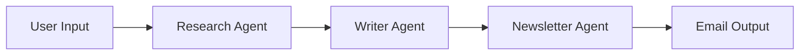

# ContentFlow - AI Newsletter Generator

An intelligent multi-agent system built with LangGraph that researches topics, writes articles, and generates newsletters automatically.

## 🚀 Features

- **Research Agent**: Searches and gathers information on any topic
- **Writer Agent**: Creates comprehensive articles from research
- **Newsletter Agent**: Generates email-ready summaries
- **LangSmith Integration**: Monitor agent performance and traces
- **FastAPI Backend**: RESTful API for easy integration
- **Railway Ready**: One-click deployment

## 📁 Project Structure
```
contentflow/
├── app.py              # FastAPI server
├── graph.py            # LangGraph workflow definition
├── agents.py           # Agent implementations
├── state.py            # Shared state schema
├── config.py           # Agent configurations
├── requirements.txt    # Python dependencies
├── railway.json        # Railway deployment config
└── README.md          # This file
```

## 🛠️ Setup

### Local Development

1. Clone the repository:
```bash
git clone https://github.com/yourusername/contentflow.git
cd contentflow
```

2. Create virtual environment:
```bash
python -m venv venv
source venv/bin/activate  # On Windows: venv\Scripts\activate
```

3. Install dependencies:
```bash
pip install -r requirements.txt
```

4. Set environment variables:
```bash
export OPENAI_API_KEY="your-openai-key"
export LANGCHAIN_API_KEY="your-langsmith-key"
```

5. Run the server:
```bash
python app.py
```

### Railway Deployment

1. Fork this repository
2. Connect Railway to your GitHub
3. Create new project from the repo
4. Add environment variables in Railway:
   - `OPENAI_API_KEY`
   - `LANGCHAIN_API_KEY`
5. Deploy!

## 📡 API Endpoints

### Generate Newsletter
```http
POST /generate-newsletter
Content-Type: application/json

{
  "topic": "AI developments this week",
  "recipient_email": "user@example.com"
}
```

### Check Health
```http
GET /health
```

### Get Workflow Result
```http
GET /workflow/{thread_id}
```

### Visualize Workflow
```http
GET /workflow/visualize/graph
```

## 🔑 Environment Variables

| Variable | Description | Required |
|----------|-------------|----------|
| `OPENAI_API_KEY` | OpenAI API key for LLMs | Yes |
| `LANGCHAIN_API_KEY` | LangSmith API key for tracing | Yes |
| `PORT` | Server port (default: 8000) | No |

## 🏗️ Architecture


## 🎯 Usage Example
```python
import requests

# Generate newsletter
response = requests.post(
    "https://your-app.railway.app/generate-newsletter",
    json={
        "topic": "sustainable coffee farming",
        "recipient_email": "subscriber@example.com"
    }
)

result = response.json()
print(f"Newsletter generated: {result['data']['article_title']}")
```

## 📊 Agent Configuration

Each agent can be configured in `config.py`:

- **Models**: GPT-3.5-turbo, GPT-4, etc.
- **Temperature**: Creativity level (0.0-1.0)
- **Tools**: Web search, Wikipedia, etc.
- **Guardrails**: Timeouts, retries, validation

## 🐛 Debugging

1. Check LangSmith dashboard for traces
2. View logs in Railway dashboard
3. Use `/workflow/{thread_id}` to inspect full state

## 📝 License

MIT License - feel free to use in your projects!

## 🤝 Contributing

1. Fork the repository
2. Create feature branch
3. Commit changes
4. Push to branch
5. Open pull request

---

Built with ❤️ using LangGraph and FastAPI
